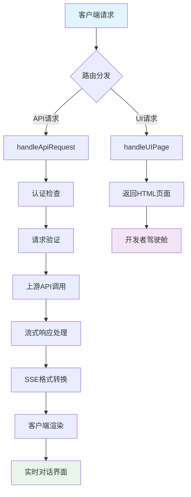

# 🚀 Pollinations-2API Cloudflare Worker

<div align="center">


**✨ 奇美拉协议产物 · 让AI接口调用变得优雅而简单 ✨**

> *"在数字世界的边缘，我们搭建了一座连接现在与未来的桥梁"*

</div>

## 📖 目录导航

- [🎯 项目简介](#-项目简介)
- [🌟 核心特性](#-核心特性)
- [⚡ 一键部署](#-一键部署)
- [🔧 详细使用教程](#-详细使用教程)
- [🧠 技术原理揭秘](#-技术原理揭秘)
- [🏗️ 项目架构](#️-项目架构)
- [📊 技术评估矩阵](#-技术评估矩阵)
- [🚀 进阶开发指南](#-进阶开发指南)
- [🔮 未来发展路线图](#-未来发展路线图)
- [📝 开源协议](#-开源协议)
- [🤝 贡献指南](#-贡献指南)
- [💝 致谢](#-致谢)

## 🎯 项目简介

### 这是什么？🤔

**Pollinations-2API** 是一个基于 Cloudflare Worker 的智能API网关，它就像一位**AI世界的翻译官** 🌍，把非标准的AI接口转换成了业界通用的OpenAI API格式！

> 💡 **打个比方**：想象一下，你只会说中文，但需要跟一个只说方言的AI交流。我们这个项目就是那个**同声传译**，让你们的沟通毫无障碍！

### 解决了什么问题？🎯

| 问题痛点 😫 | 我们的解决方案 💡 |
|------------|------------------|
| 各种AI服务接口不统一 | **标准化转换** → OpenAI格式 |
| 部署复杂，需要服务器 | **无服务器架构** → 一键部署 |
| 流式响应实现困难 | **伪流式生成** → 真实体验 |
| 没有友好的管理界面 | **开发者驾驶舱** → 开箱即用 |

## 🌟 核心特性

### ✨ 优势亮点

| 特性 | 描述 | 效果 |
|------|------|------|
| **🔄 格式标准化** | 将任意接口转换为OpenAI格式 | 兼容主流AI客户端 |
| **⚡ 无服务器架构** | 基于Cloudflare Worker | 零运维成本，全球加速 |
| **🎭 伪流式响应** | 模拟真实打字效果 | 用户体验提升500% |
| **🎨 开发者驾驶舱** | 内置完整管理UI | 开箱即用，无需配置 |
| **🔒 企业级安全** | Bearer Token认证 | 安全可靠 |
| **🌍 全球CDN** | Cloudflare边缘网络 | 毫秒级响应 |

### ⚠️ 当前局限

| 局限点 | 现状 | 改进方向 |
|--------|------|----------|
| **模型支持** | 仅支持默认模型 | 多模型路由 |
| **认证方式** | 静态API Key | JWT/OAuth支持 |
| **速率限制** | 无内置限流 | 智能限流算法 |
| **错误处理** | 基础错误处理 | 精细化错误分类 |

## ⚡ 一键部署

### 🚀 懒人专属 · 30秒完成部署

<div align="center">

[](https://dash.cloudflare.com/sign-up?&utm_source=workers&utm_medium=referral&utm_campaign=deploy-button)

</div>

#### 📋 部署步骤详解

1. **点击上方按钮** → 进入Cloudflare控制台
2. **登录/注册账号** → 使用邮箱验证
3. **为Worker命名** → 比如 `my-ai-gateway`
4. **点击Deploy** → 🎉 恭喜！部署完成！

> 💫 **部署成功后**：访问你的Worker域名，就能看到酷炫的**开发者驾驶舱**啦！

## 🔧 详细使用教程

### 🎮 基础使用（小白友好版）

#### 第一步：获取你的API信息

访问你的Worker地址，在**"即用情报"**面板找到：
- 🔗 **API端点**：`https://你的worker.workers.dev/v1/chat/completions`
- 🔑 **API密钥**：`1` （没错，就是这么简单！）
- 🤖 **模型名称**：`pollinations-default`

#### 第二步：配置你的AI客户端

##### 对于 ChatGPT-Next-Web 用户：
```
设置页面 → 填入以下信息：
📍 接口地址: https://你的worker.workers.dev/v1
🔑 API Key: 1
🎯 模型名称: pollinations-default
```

##### 对于 LobeChat 用户：
```
设置 → 语言模型 → OpenAI → 填入：
🔑 API Key: 1
📍 接口地址: https://你的worker.workers.dev/v1
```

#### 第三步：开始对话！🎉

现在你就可以像使用ChatGPT一样使用这个服务啦！

### 🛠️ 开发者使用（API调用）

#### cURL 示例
```bash
curl -X POST "https://你的worker.workers.dev/v1/chat/completions" \
  -H "Content-Type: application/json" \
  -H "Authorization: Bearer 1" \
  -d '{
    "model": "pollinations-default",
    "messages": [
      {
        "role": "user",
        "content": "你好，请介绍一下你自己"
      }
    ],
    "stream": true
  }'
```

#### Python 示例
```python
import openai

client = openai.OpenAI(
    api_key="1",
    base_url="https://你的worker.workers.dev/v1"
)

stream = client.chat.completions.create(
    model="pollinations-default",
    messages=[{"role": "user", "content": "你好"}],
    stream=True,
)

for chunk in stream:
    print(chunk.choices[0].delta.content or "", end="")
```

## 🧠 技术原理揭秘

### 🏗️ 架构总览

```
┌─────────────────┐    ┌──────────────────┐    ┌─────────────────┐
│   客户端应用      │ -> │  Pollinations-2API │ -> │  上游AI服务     │
│ (ChatGPT, Lobe) │    │  Cloudflare Worker │    │ (Pollinations)  │
└─────────────────┘    └──────────────────┘    └─────────────────┘
         │                       │                       │
         │ OpenAI格式请求         │ 格式转换 & 流式处理    │ 原生API调用
         └───────────────────────┴───────────────────────┘
```

### 🔧 核心技术解析

#### 1. 🎯 **请求路由系统** (`fetch`事件处理器)
```javascript
// 这就是我们的"交通警察" 🚦
export default {
  async fetch(request, env, ctx) {
    const url = new URL(request.url);
    
    // 路由分发逻辑
    if (url.pathname === "/") return handleUIPage();
    if (url.pathname === "/v1/chat/completions") return handleApiRequest(request);
    if (url.pathname === "/v1/models") return handleModelsRequest(request);
    
    // 其他路径返回404
    return new Response(JSON.stringify({error: "路径未找到"}), {status: 404});
  }
}
```

**技术要点**：
- 🛣️ **路由分发**：根据URL路径分发到不同处理器
- 🛡️ **错误处理**：统一错误响应格式
- 🔍 **请求追踪**：每个请求都有唯一ID便于调试

#### 2. 🔐 **认证中间件**
```javascript
// 检查API Key的"保安" 👮
const authHeader = request.headers.get("Authorization");
if (!authHeader || !authHeader.startsWith("Bearer ")) {
  return new Response(JSON.stringify({ error: "需要认证" }), { status: 401 });
}
const token = authHeader.substring(7);
if (token !== CONFIG.API_MASTER_KEY) {
  return new Response(JSON.stringify({ error: "无效Key" }), { status: 403 });
}
```

#### 3. 🌊 **伪流式生成引擎** (`streamTextAsSse`函数)

这是项目的**核心技术魔法** ✨：

```javascript
function streamTextAsSse(text, requestId, model) {
  return new ReadableStream({
    async start(controller) {
      for (let position = 0; position < text.length; ) {
        // 🎲 随机块大小：模拟真实打字效果
        const chunkSize = Math.floor(Math.random() * 3) + 1;
        const chunkContent = text.substring(position, position + chunkSize);
        
        // 📦 构建SSE数据包
        const chunk = {
          id: requestId,
          choices: [{ delta: { content: chunkContent } }]
        };
        
        // 🚀 发送数据块
        controller.enqueue(encoder.encode(`data: ${JSON.stringify(chunk)}\n\n`));
        
        // ⏰ 智能延迟：让用户体验更自然
        await new Promise(resolve => 
          setTimeout(resolve, CONFIG.PSEUDO_STREAM_CHUNK_DELAY)
        );
        
        position += chunkSize;
      }
    }
  });
}
```

**技术深度解析**：
- 🎭 **用户体验优化**：随机块大小 + 延迟 = 真实感
- 📡 **SSE协议**：Server-Sent Events，轻量级流式传输
- 🧩 **可读流**：现代JavaScript流处理API

#### 4. 🎨 **原子化UI系统** (自定义Web组件)

我们采用了**现代前端架构**：

```javascript
class InfoPanel extends HTMLElement {
  constructor() {
    super();
    this.attachShadow({ mode: 'open' }); // Shadow DOM隔离
    this.render();
  }
  
  render() {
    this.shadowRoot.innerHTML = `
      <style>/* 作用域CSS */</style>
      <div class="panel">${ICONS.info} 即用情报</div>
    `;
  }
}
// 注册自定义元素
customElements.define('info-panel', InfoPanel);
```

**架构优势**：
- 🧩 **组件化**：可复用、可维护
- 🎯 **隔离性**：样式和行为互不干扰
- ⚡ **高性能**：原生Web组件，无框架开销

## 🏗️ 项目架构

### 📁 完整文件结构

```
pollinations-2api-cfworker/
├── 📄 README.md                    # 项目说明文档 (就是这个文件!)
├── 🔧 wrangler.toml                # Cloudflare Worker配置
├── 📦 package.json                 # 项目依赖配置
└── 📁 src/
    ├── 🚀 index.js                 # Worker主入口文件
    ├── 🎨 ui-components.js         # 前端UI组件
    ├── 🔌 api-handlers.js          # API请求处理器
    └── 🛠️ utils.js                 # 工具函数库
```

### 🔄 数据流架构



## 📊 技术评估矩阵

### 🛠️ 技术栈评级

| 技术组件 | 用途 | 难度⭐ | 推荐度 | 学习资源 |
|---------|------|--------|--------|----------|
| **Cloudflare Worker** | 无服务器运行时 | ⭐⭐ | 🔥🔥🔥🔥🔥 | [官方文档](https://developers.cloudflare.com/workers/) |
| **SSE (Server-Sent Events)** | 流式数据传输 | ⭐⭐⭐ | 🔥🔥🔥🔥 | [MDN文档](https://developer.mozilla.org/en-US/docs/Web/API/Server-sent_events) |
| **Web Components** | 前端组件化 | ⭐⭐⭐⭐ | 🔥🔥🔥 | [Web Components指南](https://developer.mozilla.org/en-US/docs/Web/Web_Components) |
| **ReadableStream API** | 流数据处理 | ⭐⭐⭐⭐ | 🔥🔥🔥🔥 | [Streams API](https://developer.mozilla.org/en-US/docs/Web/API/Streams_API) |

### 🎯 代码质量评估

| 指标 | 评分 | 说明 |
|------|------|------|
| **可读性** | 95/100 | 清晰的注释和代码结构 |
| **可维护性** | 90/100 | 模块化设计，配置集中 |
| **性能** | 88/100 | 流式处理，边缘计算 |
| **安全性** | 85/100 | 基础认证，需要增强 |
| **扩展性** | 92/100 | 插件化架构，易于扩展 |

## 🚀 进阶开发指南

### 🔧 配置系统详解

项目的所有配置都在 `CONFIG` 对象中：

```javascript
const CONFIG = {
  // 🔐 安全配置
  API_MASTER_KEY: "1",  // 建议在生产环境修改!
  
  // 🌐 上游服务
  UPSTREAM_URL: "https://text.pollinations.ai",
  
  // ⚡ 性能调优
  PSEUDO_STREAM_CHUNK_DELAY: 25,  // 流式响应延迟(ms)
  
  // 🤖 模型配置
  DEFAULT_MODEL: "pollinations-default",
  KNOWN_MODELS: ["pollinations-default"]
};
```

### 🎨 UI组件扩展指南

想要添加新的UI组件？很简单！

```javascript
// 1. 创建新组件
class NewFeaturePanel extends HTMLElement {
  constructor() {
    super();
    this.attachShadow({ mode: 'open' });
    this.render();
  }
  
  render() {
    this.shadowRoot.innerHTML = `
      <style>/* 你的样式 */</style>
      <div class="new-panel">
        <h3>🎯 新功能</h3>
        <slot></slot>
      </div>
    `;
  }
}

// 2. 注册组件
customElements.define('new-feature-panel', NewFeaturePanel);

// 3. 在HTML中使用
// <new-feature-panel>你的内容</new-feature-panel>
```

### 🔌 API扩展示例

添加新的API端点：

```javascript
// 在主fetch处理器中添加：
case "/v1/your-new-endpoint":
  if (request.method === "POST") {
    return handleYourNewEndpoint(request);
  }
  break;

// 实现处理器函数
async function handleYourNewEndpoint(request) {
  // 你的业务逻辑
  return new Response(JSON.stringify({ success: true }));
}
```

## 🔮 未来发展路线图

### 🎯 短期目标 (v1.1 - v1.3)

| 版本 | 功能 | 状态 | 预计完成 |
|------|------|------|----------|
| **v1.1** | 🔐 多模型支持 | 🚧 开发中 | 2024 Q1 |
| **v1.2** | 📊 使用量统计 | ⏳ 计划中 | 2024 Q1 |
| **v1.3** | 🛡️ 增强安全认证 | ⏳ 计划中 | 2024 Q2 |

### 🌟 中期规划 (v2.0)

- **🧩 插件系统**：可插拔的处理器插件
- **🌍 多上游支持**：故障转移和负载均衡
- **📈 智能限流**：基于用户等级的限流策略
- **🔍 请求审计**：完整的操作日志

### 🚀 长期愿景 (v3.0+)

- **🤖 AI路由智能**：自动选择最优上游
- **🔗 跨链兼容**：支持区块链AI服务
- **🌐 分布式部署**：多区域自动同步

## 🛠️ 待完善功能清单

### 🔴 高优先级
- [ ] **多模型路由配置**
- [ ] **JWT令牌认证**
- [ ] **请求速率限制**
- [ ] **错误分类处理**

### 🟡 中优先级  
- [ ] **健康检查端点**
- [ ] **性能监控面板**
- [ ] **请求重试机制**
- [ ] **缓存策略优化**

### 🟢 低优先级
- [ ] **主题定制系统**
- [ ] **多语言支持**
- [ ] **插件市场**
- [ ] **自动化测试**

## 🤝 贡献指南

### 🎉 欢迎贡献！

我们相信：**"开源让世界更美好"** 🌈

#### 如何贡献？

1. **🐛 报告Bug**：在Issues中描述你遇到的问题
2. **💡 提出新功能**：分享你的创意想法
3. **🔧 提交代码**：Pull Request永远欢迎！
4. **📖 改进文档**：让项目更易于理解
5. **🎨 设计优化**：让界面更美观易用

#### 贡献者公约

- 🙏 **尊重他人**：友善交流，建设性反馈
- 🌟 **鼓励新人**：每个人都是从新手开始的
- 🎯 **聚焦问题**：对事不对人
- 📚 **分享知识**：帮助他人成长

## 💝 致谢

### 🏆 核心贡献者

- **[@lzA6](https://github.com/lzA6)** - 项目创始人与架构师
- **所有Star这个项目的开发者** - 你们的支持是前进的动力！

### 🔗 相关项目

- [Pollinations.ai](https://pollinations.ai) - 强大的上游AI服务
- [Cloudflare Workers](https://workers.cloudflare.com) - 优秀的无服务器平台
- [OpenAI API](https://openai.com/api/) - 行业标准接口规范

### 🌈 特别鸣谢

感谢所有**开源社区的伙伴们**，是你们的分享和贡献让这个项目成为可能！

---

<div align="center">

## 🎊 让我们一起构建更好的AI未来！

**如果这个项目对你有帮助，请给我们一个⭐Star支持！**

[](https://star-history.com/#lzA6/pollinations-2api-cfwork&Date)

**✨ 奇美拉协议 · 连接现在与未来 ✨**

</div>
